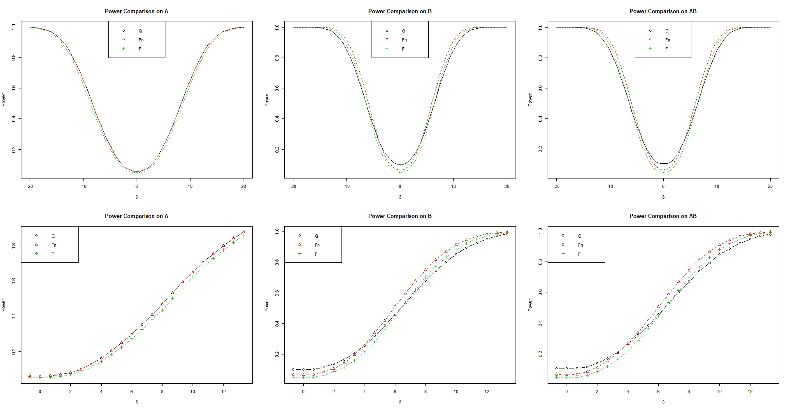
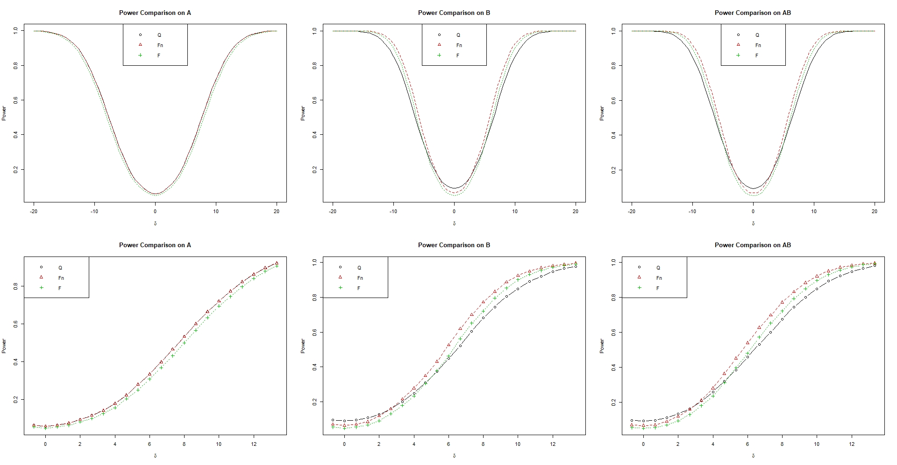

# Replicate simulations of ANOVA type statistics in Brunner, Dette and Munk (1997)


<!---
```math
\begin{aligned}
H_0^F: CF = 0 \Longleftrightarrow H_0^F: MF = C'[CC']^{-1}CF = 0
\end{aligned}
```

```math
\begin{aligned}
Q_N(\tilde{C}) & = N \hat{p}' \tilde{C} \hat{p} \sim \chi^2_{\mathrm{rank}(C)}, \\
F_N(M) & = \frac{N}{\mathrm{tr}(D_M \hat{V}_N)} \hat{p}' M \hat{p} \sim F(\hat{f},\hat{f_0}).\\
\end{aligned}
```
--->

`Case 1: a = 2; b =5, n1j = n2j = 7`



`Case 2: a = 2; b =5, n1j = n2j = (11, 10, 9, 8, 7)`



